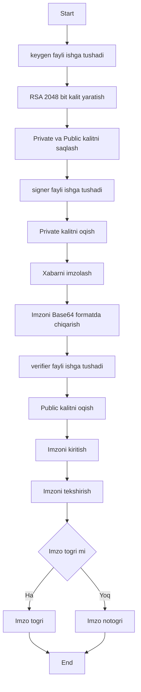

# imzolash-algoritmi

```mermaid
flowchart TD
    A[Start] --> B[keygen fayli ishga tushadi]
    B --> C[RSA 2048 bit kalit yaratish]
    C --> D[Private va Public kalitni saqlash]

    D --> E[signer fayli ishga tushadi]
    E --> F[Private kalitni oqish]
    F --> G[Xabarni imzolash]
    G --> H[Imzoni Base64 formatda chiqarish]

    H --> I[verifier fayli ishga tushadi]
    I --> J[Public kalitni oqish]
    J --> K[Imzoni kiritish]
    K --> L[Imzoni tekshirish]
    L --> M{Imzo togri mi}
    M -- Ha --> N[Imzo togri]
    M -- Yoq --> O[Imzo notogri]
    N --> P[End]
    O --> P
```
